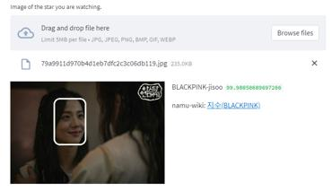

# Detecting idol stars with Amazon Rekognition

## [rekognition](rekognition)
Logical model scripts for running backend
- [rekognition/search_face.py](rekognition/search_face.py)

## [flask_app.py](flask_app.py)
1. API server in charge of models
2. Basic frontend (When INCLUDE_VIEWS = True)
3. Can be deployed in ec2

## [streamlit](streamlit_app.py)
Frontend
